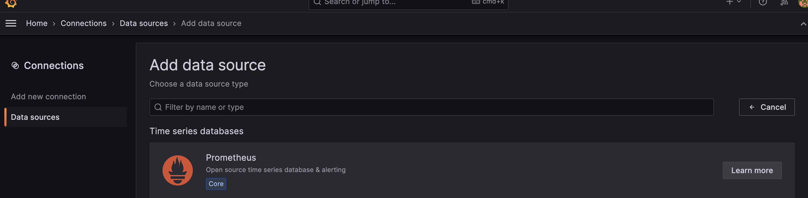
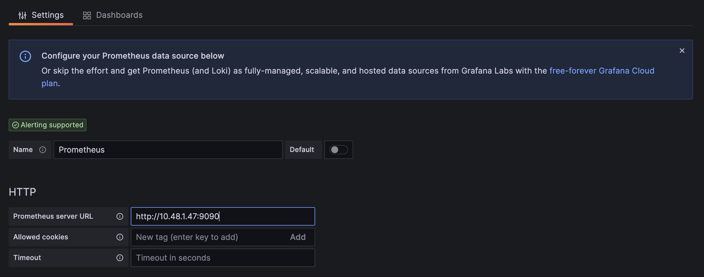
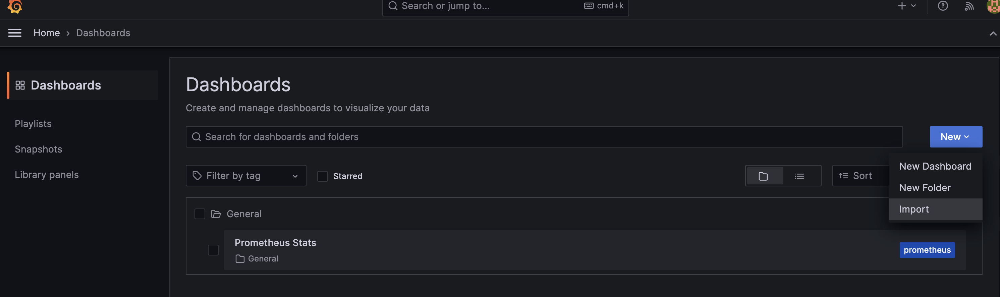
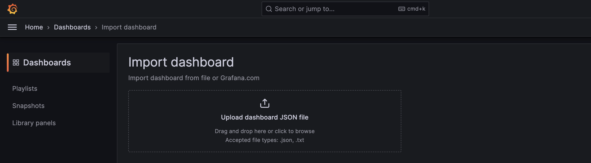
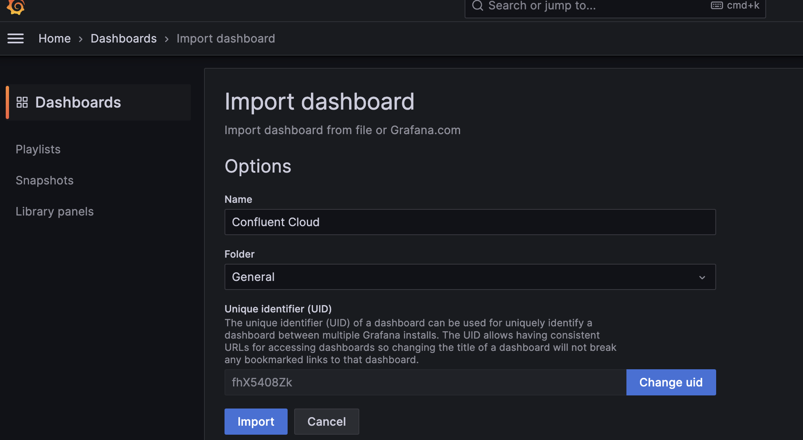
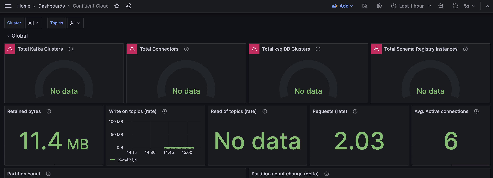

==== create a namespace for prometheus
[source,bash]
----
kubectl create namespace prometheus

----
 
=== create service user via confluent cli

[source,bash]
----
confluent login
confluent iam service-account create prommetrics --description "prometheus monitoring"
----

should result in something like this

[source]
----
+-------------+-----------------------+ 
| ID          | sa-xxxxxx             | 
| Name        | prommetrics           | 
| Description | prometheus monitoring | 
+-------------+-----------------------+ 
----

=== assign role binding
[source,bash]
----
confluent iam rbac role-binding create --role MetricsViewer --principal User:sa-35d9jo
----

check the binding
[source,bash]
----
confluent iam rbac role-binding list --principal User:sa-35d9jo
----

=== create an api key for the new service account

check the binding
[source,bash]
----
confluent api-key create --resource cloud --service-account sa-35d9jo
----

should result in something like 

[source]
----
+------------+------------------------------------------------------------------+ 
| API Key    | EIXNNADZZWLJUMQQ                                                 | 
| API Secret | bJmXgfRTNHi51nVKwbCTk5u/W41sZYZGAR7T0rkzVVS6sCoQKBFjj2J2adWV99JB | 
+------------+------------------------------------------------------------------+ 
----
note down API key and api secret for later usage

=== create the rolebinding with
[source,yaml]
----
kubectl create -f clusterRole.yml -n prometheus
----

=== adapt  config map

use the existing config-map.yaml and adapt the following

set username and password to the API Key and API Secret created above
[source,yaml]
----        
        basic_auth:
          username: EIXNNADZZWLJUMQQ
          password: bJmXgfRTNHi51nVKwbCTk5u/W41sZYZGAR7T0rkzVVS6sCoQKBFjj2J2adWV99JB
----

set your kafka cluster id accordingly (see confluent cloud ui or similar)
[source,yaml]
----  
        params:
          "resource.kafka.id":
            - lkc-pkx1jk
----

=== create the config map with
[source,yaml]
----
kubectl create -f config-map.yml -n prometheus
----

=== create the prometheus deployment
[source,yaml]
----
kubectl create  -f prometheus-deployment.yml  -n prometheus
----

=== create the grafana deployment
[source,yaml]
----
kubectl create  -f grafana.yml  -n prometheus
----

=== get the pods
[source,yaml]
----
kubectl get pods -n prometheus
----

=== create port forward 
have look for a pod like prometheus-deployment-xx-xx

[source,yaml]
----
kubectl port-forward prometheus-deployment-57898c796b-rkgcs 9090:9090 -n prometheus
----

prometheus should reachable on your localhost via port 9090

do the same for grafana

=== add prometheus as data source

login to grafana via localhost:3000 (admin/admin)

go to Connections --> Data sources 

Click Add data source

Choose prometheus

enter prometheus server url, e.g. http://10.48.1.47:9090 

scroll to the bottom of the page click save & test

--> a success message should appear

=== import example dashboards to grafana

Import the example dashboard from link:assets/grafana/ccloud.json[here] via grafana ui.

